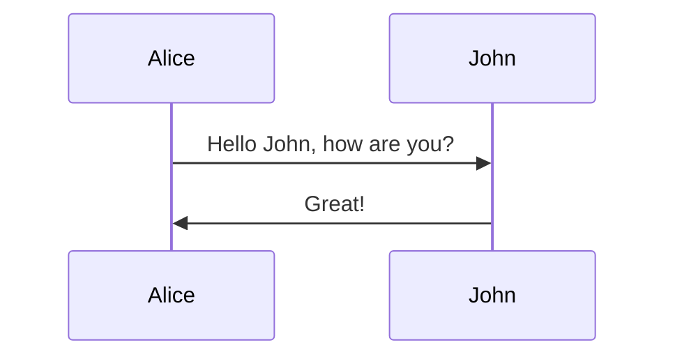
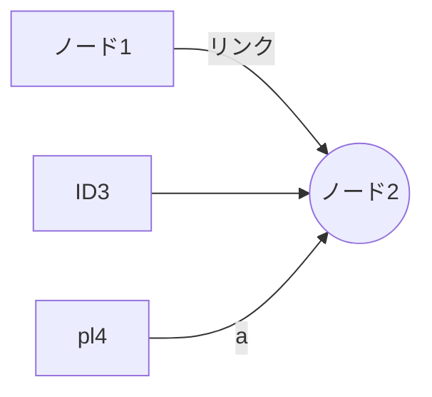

# 2018/11/22

- sample

```mermaid
sequenceDiagram
    Alice->>John: Hello John, how are you?
    John->>Alice: Great!
```

```mermaid
graph LR
    ID1[ノード1] -- リンク --> ID2((ノード2))
    ID3 --> ID2
		pl4 -- a --> ID2
```

# 2018/11/29
